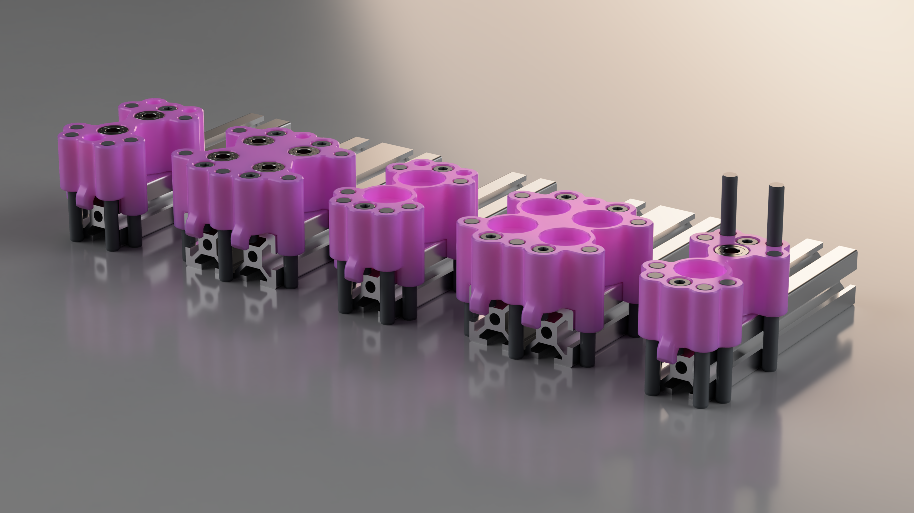

[![CC BY-NC-SA 4.0][cc-by-nc-sa-shield]][cc-by-nc-sa]

This work is licensed under a  
[Creative Commons Attribution-NonCommercial-ShareAlike 4.0 International License][cc-by-nc-sa].

[![CC BY-NC-SA 4.0][cc-by-nc-sa-image]][cc-by-nc-sa]

[cc-by-nc-sa]: http://creativecommons.org/licenses/by-nc-sa/4.0/
[cc-by-nc-sa-image]: https://licensebuttons.net/l/by-nc-sa/4.0/88x31.png
[cc-by-nc-sa-shield]: https://img.shields.io/badge/License-CC%20BY--NC--SA%204.0-lightgrey.svg

## Introduction

These jigs enable precise drilling of 20-series aluminum extrusions for through-hole counterbored joints and access-hole blind joints.

### Features
- Double bearing guides with tight tolerances provide excellent drill bit support for precise, clean holes
- Multi-point T-nut clamping for secure fixture connection
- T-nut anti-spin design prevents T-nuts from rotating, enabling quick and easy installation
- Optional side alignment pins for improved alignment and jig longevity
- End alignment pins for common 10 mm fixed-offset drilling
- Convenient alignment marks for matching to measured locations on the extrusion
- Designed for Additive Manufacturing (DfAM)
- Included parameter file for easy user customization
- Optional multi-purpose jig that handles various extrusion sizes and joint types — ideal for non-repetitive or mixed jobs where setup/removal time is acceptable in exchange for fewer dedicated tools

## Hardware

| Item                                      | Recommended Source                                                                 |
|-------------------------------------------|------------------------------------------------------------------------------------|
| 685ZZ 5×11×5 mm bearing                   | [Aliexpress](https://www.aliexpress.com/item/1005006224445582.html)               |
| R1028ZZ 3/8" × 5/8" × 5/32" bearing       | [Amazon.ca](https://www.amazon.ca/HiPicco-R1038ZZ-Bearings-Miniature-Shielded/dp/B0CH37GYYF?th=1), [Amazon.com](https://www.amazon.com/FOCMKEAS-R1038ZZ-Industrial-Mechanical-Equipment/dp/B0B6WRXGZR) |
| 5 mm × 40 mm pin (or custom length)       | [Aliexpress](https://www.aliexpress.com/item/4000473863693.html)|
| 5 mm drill bit                            | [Aliexpress - XUHAN](https://www.aliexpress.com/item/1005002617939096.html)       |
| 5.5 mm drill bit (for 4040 counterbore)   | [Aliexpress - XUHAN](https://www.aliexpress.com/item/1005002617939096.html)       |
| 5.5–9.5 mm step drill                     | [Aliexpress - DrillForce](https://www.aliexpress.com/item/32914005099.html#nav-specification) |
| 5 mm and 9.5 mm depth stop collars        | [Aliexpress](https://www.aliexpress.com/item/1005005826023888.html)               |
| M4 T-nut (9.5 mm length)                  | [Aliexpress](https://www.aliexpress.com/item/1005007883028035.html)               |
| M4 × 20 mm SHCS screw                     | [Aliexpress](https://www.aliexpress.com/item/1005004527586307.html)               |

## Important Notes
- Check the CAD files for exact quantities required per jig variant.
- Drill bits have very tight clearance with the bearings — lubricant is highly recommended for smooth motion and better cutting performance.
- Pin holes should be drilled/reamed to 5 mm; apply light grease or lubricant so pins slide easily but do not fall out.
- Side alignment pins are optional for most variants (required for the multi-jig version); front/end alignment pins provide a fixed 10 mm offset.
- Counterbore overhangs are intentionally bridged to simplify printing — insert bearings first, then drill out.
- If printed tolerances do not match your needs (e.g., too tight/loose), adjust them using the included Fusion 360 parameter file.
- The 9.5 mm T-nut length is required for the anti-spin feature to function correctly (length can be adjusted in the CAD if needed).
- For 4040 extrusions in through-hole counterbored joints, a separate 5.5 mm drill bit is needed to fully finish the 5.5 mm pilot/clearance hole through the full profile thickness, as the step drill alone may not penetrate deeply enough on both sides for a clean result.
